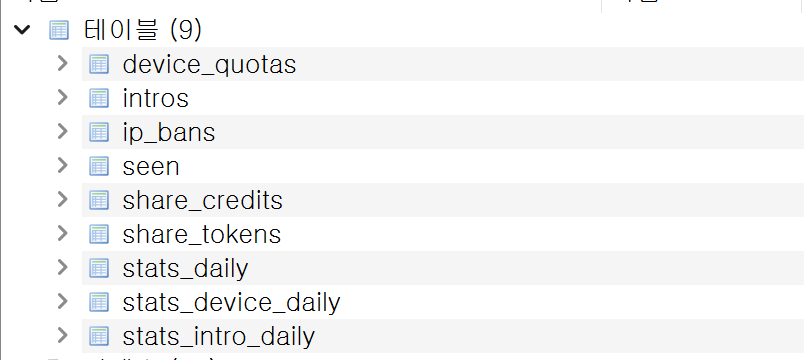
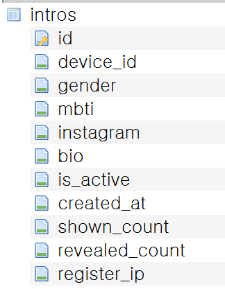

# 서론
이번에 빅데이터 분석을 접하면서 처음으로 다양한 분석 기법들을 접하게 되었다.
앞으로 내가 얻은 데이터들을 하나하나 분석해보며 실습을 해보려 한다.

```
위주로 살펴볼 데이터
- 부동산 데이터: 전국 기준
- 프로젝트 운영 데이터
```

# 1. 데이터의 윤곽보기
일단 수집한 데이터들의 윤곽을 보기 위해서는 데이터 분석의 파이프라인을 따라야 한다.
우선 내가 갖고있는 데이터베이스를 보자
## 1. HOLO 서비스 운영 DB

<details>
  <summary>LLM 이용 내역</summary>

  - 사용 서비스 MS Copilot  

  md파일에 이미지 넣는 법 알려줘


  Markdown 파일에 이미지를 넣는 방법은 아주 간단해요. 기본 문법은 다음과 같습니다:
  ``` markdown
  

  - `![대체 텍스트]` : 이미지가 표시되지 않을 때 대신 보여줄 설명 텍스트입니다. 접근성에도 중요해요.  
  - `(이미지_경로)` : 이미지 파일의 상대 경로나 절대 경로, 또는 웹 URL을 넣을 수 있습니다.  
  - `"이미지 제목"` : 선택 사항으로, 마우스를 올렸을 때 툴팁처럼 표시됩니다.  

   예시
  1. 로컬 파일 불러오기:  
     

  2. 웹 이미지 불러오기:  
     

  3. 크기 조정 (Markdown 자체는 지원하지 않지만, HTML 태그를 섞어 쓸 수 있습니다):  
     
  ```

</details>
<details>
  <summary>LLM 이용 내역</summary>
 
  - 사용 서비스 MS Copilot

    혹시 md 파일에서 접었다 폈다 할 수 있어?
  
  
좋아요, 그 부분을 접었다 펼 수 있게 하려면 `<details>` 태그를 쓰면 됩니다. 예를 들어, 말씀하신 **LLM 이용 내역** 부분을 이렇게 감싸면 돼요:

```markdown
<details>
  <summary>LLM 이용 내역</summary>

  - 사용 서비스 MS Copilot  
  Markdown 파일에 이미지를 넣는 방법은 아주 간단해요. 기본 문법은 다음과 같습니다:

  

  - `![대체 텍스트]` : 이미지가 표시되지 않을 때 대신 보여줄 설명 텍스트입니다. 접근성에도 중요해요.  
  - `(이미지_경로)` : 이미지 파일의 상대 경로나 절대 경로, 또는 웹 URL을 넣을 수 있습니다.  
  - `"이미지 제목"` : 선택 사항으로, 마우스를 올렸을 때 툴팁처럼 표시됩니다.  

   예시
  1. 로컬 파일 불러오기:  
     

  2. 웹 이미지 불러오기:  
     

  3. 크기 조정 (Markdown 자체는 지원하지 않지만, HTML 태그를 섞어 쓸 수 있습니다):  
     

</details>
```

이렇게 하면 GitHub 같은 환경에서는 "LLM 이용 내역"이라는 제목을 클릭하면 접히고 펼쳐지게 됩니다.  

👉 혹시 이 문서를 **GitHub README.md**로 쓰실 계획인가요, 아니면 다른 Markdown 뷰어에서 보실 건가요? 환경에 따라 `<details>` 지원 여부가 달라질 수 있어요.

</details>
우선 이 DB는 2025년 가을 축제 기간 동안 운영했던 소개팅 서비스 HOLO의 데이터 베이스이다.  
HOLO 서비스는 9개의 테이블로 운영되었다. 가장 먼저 테이블이 어떻게 구성되어있는지 보자

### 1-1. 테이블 분석

 1. device_quotas
```이 테이블은 디바이스의 아이디에 얼만큼의 크레딧이 있고 얼마나 사용했는지 저장하는 테이블이다.```

 2. intros
```이 테이블은 각각 유저가 적은 한 줄 소개와 이 소개가 얼만큼 노출되고 선택되었는지 나타내는 테이블이다.```

 3. ip_bans
```이 테이블은 부정사용자를 막기 위해 ip 벤과 벤 사유를 저장하는 테이블이다.```

 4. seen
```이 테이블은 기존 테이블 기능과 분리해 운영중에 새로운 기능을 추가하기 위해 만든 테이블로, 언제 마지막으로 노출되었는지를 저장한다.```

 5. share_credits
```이 테이블은 친구 초대로 이 페이지에 들어온 사람들이 각각 누구에게 소개를 받았는지 저장하는 테이블이다.```

 6. share_tockens
```이 테이블은 토큰들을 관리하는 테이블이다.```

 7. stats_daily
```이 테이블은 관리자의 운영을 위해 일일 기록을 저장하는 테이블이다.```

 8. stats_device_daily
```이 테이블은 DAU를 측정하기 위해 활성화 된 디바이스의 로그를 저장하는 테이블이다.```

 9. stats_intro_daily
```이 테이블은 인트로별 얼마나 노출되었는지 관리하는 파생 데이터이다.```

이 중 가장 가치가 있어보이는 테이블 intros의 행별 의미를 분석해 보겠다.

### 1-2. intro 교차표 작성



행이 id, device_id, gender, mbti, instagram, bio, is_active, created_at, shown_count, revealed_count, register_ip로 이루어져 있다.


<details>
  <summary>LLM 이용 내역</summary>
 
    - 사용 서비스 MS Copilot

        혹시 md 파일에서 접었다 폈다 할 수 있어?
    
    
    좋아요, 그 부분을 접었다 펼 수 있게 하려면 `<details>` 태그를 쓰면 됩니다. 예를 들어, 말씀하신 **LLM 이용 내역** 부분을 이렇게 감싸면 돼요:

    ``` markdown
    <details>
    <summary>LLM 이용 내역</summary>

    - 사용 서비스 MS Copilot 
    
    혹시 마크다운에서 표는 어떻게 만들어

    Markdown에서 표를 만드는 방법은 기본적으로 **파이프(`|`)와 하이픈(`-`)**을 이용하는 거예요. 구조는 다음과 같습니다:

    ```markdown
    | 헤더1 | 헤더2 | 헤더3 |
    |-------|-------|-------|
    | 데이터1 | 데이터2 | 데이터3 |
    | 데이터4 | 데이터5 | 데이터6 |
    ```

    ### 결과
    | 헤더1 | 헤더2 | 헤더3 |
    |-------|-------|-------|
    | 데이터1 | 데이터2 | 데이터3 |
    | 데이터4 | 데이터5 | 데이터6 |

    ---

    ### 정렬 옵션
    헤더 구분선(`-`)에 콜론(`:`)을 추가하면 정렬을 지정할 수 있습니다:

    ```markdown
    | 왼쪽 정렬 | 가운데 정렬 | 오른쪽 정렬 |
    |:---------|:----------:|------------:|
    | 데이터1  | 데이터2    | 데이터3     |
    | 데이터4  | 데이터5    | 데이터6     |
    ```

    ### 결과
    | 왼쪽 정렬 | 가운데 정렬 | 오른쪽 정렬 |
    |:---------|:----------:|------------:|
    | 데이터1  | 데이터2    | 데이터3     |
    | 데이터4  | 데이터5    | 데이터6     |

    ---

    👉 요약하면, **`|`로 칸을 나누고 `-`로 헤더와 본문을 구분**하면 표가 만들어집니다. 정렬까지 하고 싶으면 `:`을 활용하면 돼요.  

    혹시 원하시는 표가 **간단한 데이터 정리용**인지, 아니면 **GitHub README 같은 문서에서 보기 좋게 꾸미는 용도**인지 알려주실래요? 용도에 따라 조금 더 예쁘게 꾸미는 팁을 알려드릴 수 있어요.

</details>


|   id  | device_id | gender | mbti | instagram | bio | is_active | created_at | shown_count | revealed_count | register_ip |
|-------|-----------|--------|------|-----------|-----|-----------|------------|-------------|----------------|------------|
| index | 디바이스 토큰 | 성별 | MBTI  | 인스타 아이디 | 설명 | 활성화 | 생성시 | 노출 횟수 | 선택 횟수 | 가입된 아이피 |
| 연속형 | 비정형 | 범주형 | 범주형  | 비정형 | 비정형 | 범주형 | 연속형 | 연속형 | 연속형 | 연속형 |


1.교차표 만들기
우선 우리는 생성 시를 3일로 1일차 2일차 3일차로 범주형으로 사용하기로 했다.  
그리고 이걸 shown_count와 교차표를 제작하기로 했다.  
추가로 성별, MBTI별, 설명 길이별 교차표도 제작했다

<details>
    <summary>일시별 교차표 쿼리문</summary>
    
    WITH DateCalc AS (
        SELECT 
            shown_count,
            CAST(
                julianday(date(created_at)) - 
                julianday((SELECT date(MIN(created_at)) FROM intros)) 
            AS INTEGER) + 1 AS day_diff
        FROM intros
    )
    SELECT 
        '평균 노출 횟수(shown_count)' AS "구분",
        ROUND(AVG(CASE WHEN day_diff = 1 THEN shown_count END), 2) AS "1일차",
        ROUND(AVG(CASE WHEN day_diff = 2 THEN shown_count END), 2) AS "2일차",
        ROUND(AVG(CASE WHEN day_diff = 3 THEN shown_count END), 2) AS "3일차",
        ROUND(AVG(CASE WHEN day_diff > 3 THEN shown_count END), 2) AS "기타(4일 이상)",
        ROUND(AVG(shown_count), 2) AS "전체 평균"
    FROM DateCalc; 
</details>

| 구분 | 1일차 | 2일차 | 3일차 | 기타 | 전체 평균 |
|----|----|----|----|----|----|
| 평균 노출 횟수(shown_count) | 80.33 | 207.61 | 96.83 | 10.84 | 138.94 |

이걸로 2일차에 서비스에 사람이 많이 몰렸다는 것을 알 수 있다. 


<details>
    <summary>성별 교차표 쿼리문</summary>

    SELECT 
        CASE 
            WHEN gender IN ('M') THEN '남성'
            WHEN gender IN ('F') THEN '여성'
            ELSE '기타/미입력'
        END AS "성별 그룹",
        COUNT(*) AS "총 생성 건수",
        ROUND(AVG(shown_count), 2) AS "평균 노출 횟수(shown_count)",
        MAX(shown_count) AS "최고 대박 노출 수"
    FROM intros
    GROUP BY 
        CASE 
            WHEN gender IN 'M' THEN '남성'
            WHEN gender IN 'F' THEN '여성'
            ELSE '기타/미입력'
        END
    ORDER BY "평균 노출 횟수(shown_count)" DESC; ```
</details>

| 성별 | 작성횟수 | 평균 노출 횟수 | 노출 건수 |
|----|----|----|----|
| 여성 | 133 | 430.52 | 1022 |
| 남성 | 387 | 39.09 |	3238 |
| 기타/미입력 |	1 |	0.0	0 |

<details>
    <summary>MBTI 교차표 쿼리문</summary>

    SELECT 
        UPPER(mbti) AS "MBTI 유형",
        COUNT(*) AS "총 생성 건수",
        ROUND(AVG(shown_count), 2) AS "평균 노출 횟수",
        MAX(shown_count) AS "최대 노출 수"
    FROM intros
    WHERE mbti IS NOT NULL AND mbti != ''
    GROUP BY UPPER(mbti)
    ORDER BY "평균 노출 횟수" DESC; ```
</details>

| MBTI 유형 | 총 생성 건수 | 평균 노출 횟수 | 최대 노출 수 |
|---|---|---|---|
| ISFP | 9 | 347.78 | 785 |
| ENFP | 47 | 256.13 | 983 |
| INFP | 20 | 214.75 | 1022 |
| INFJ | 31 | 189.26 | 816 |
| ESFP | 28 | 169.43 | 721 |
| ISFJ | 22 | 164.55 | 709 |
| INTJ | 25 | 162.40 | 676 |
| INTP | 22 | 160.91 | 728 |
| ESTP | 35 | 146.00 | 3238 |
| ENFJ | 73 | 128.93 | 684 |
| ESFJ | 42 | 100.69 | 534 |
| ENTJ | 40 | 93.42 | 624 |
| ISTJ | 32 | 92.88 | 771 |
| ENTP | 40 | 87.05 | 788 |
| ESTJ | 25 | 44.40 | 529 |
| ISTP | 25 | 41.60 | 853 |
| THIS | 3 | 0.00 | 0 |
| TEST | 2 | 0.00 | 0 |


<details>
    <summary>소개 길이별 교차표 쿼리문</summary>

    SELECT 
        CASE 
            WHEN LENGTH(bio) BETWEEN 1 AND 3 THEN '1. 1~3자'
            WHEN LENGTH(bio) BETWEEN 4 AND 6 THEN '2. 4~6자'
            WHEN LENGTH(bio) BETWEEN 7 AND 10 THEN '3. 7~10자'
            WHEN LENGTH(bio) BETWEEN 11 AND 15 THEN '4. 11~15자'
            WHEN LENGTH(bio) BETWEEN 16 AND 20 THEN '5. 16~20자'
            WHEN LENGTH(bio) BETWEEN 21 AND 25 THEN '6. 21~25자'
            WHEN LENGTH(bio) BETWEEN 26 AND 30 THEN '7. 26~30자'
            ELSE '0. 기타(미입력/초과)'
        END AS "글자 수",
        COUNT(*) AS "생성 건수",
        ROUND(AVG(shown_count), 2) AS "평균 노출",
        MAX(shown_count) AS "최대 노출"
    FROM intros
    GROUP BY 1
    ORDER BY 1;```
</details>

| 글자 수 | 생성 건수 | 평균 노출 | 최대 노출 |
|---|---|---|---|
| 0. 기타(미입력/초과) | 13 | 290.08 | 3238 |
| 1. 1~3자 | 179 | 63.23 | 816 |
| 2. 4~6자 | 121 | 153.06 | 1022 |
| 3. 7~10자 | 79 | 179.08 | 912 |
| 4. 11~15자 | 70 | 191.64 | 809 |
| 5. 16~20자 | 22 | 178.77 | 665 |
| 6. 21~25자 | 26 | 165.81 | 684 |
| 7. 26~30자 | 11 | 270.09 | 917 |

이제 다중 교차표를 만들겠다

<details>
    <summary>소개 길이/ 성별 교차표 쿼리문</summary>

   SELECT 
        CASE 
            WHEN LENGTH(bio) BETWEEN 1 AND 3 THEN '1. 1~3자'
            WHEN LENGTH(bio) BETWEEN 4 AND 6 THEN '2. 4~6자'
            WHEN LENGTH(bio) BETWEEN 7 AND 10 THEN '3. 7~10자'
            WHEN LENGTH(bio) BETWEEN 11 AND 15 THEN '4. 11~15자'
            WHEN LENGTH(bio) BETWEEN 16 AND 20 THEN '5. 16~20자'
            WHEN LENGTH(bio) BETWEEN 21 AND 25 THEN '6. 21~25자'
            WHEN LENGTH(bio) BETWEEN 26 AND 30 THEN '7. 26~30자'
            ELSE '0. 기타(미입력/초과)'
        END AS "글자 수",
        ROUND(AVG(CASE WHEN UPPER(gender) = 'M' THEN shown_count END), 2) AS "남성",
        ROUND(AVG(CASE WHEN UPPER(gender) = 'F' THEN shown_count END), 2) AS "여성"
    FROM intros
    GROUP BY 1
    ORDER BY 1;
</details>


| 글자 수 | 남성 (평균 노출) | 여성 (평균 노출) |
|---|---|---|
| 0. 기타(미입력/초과) | 290.08 | - |
| 1. 1~3자 | 7.49 | 329.35 |
| 2. 4~6자 | 25.17 | 481.03 |
| 3. 7~10자 | 48.76 | 477.71 |
| 4. 11~15자 | 62.04 | 456.48 |
| 5. 16~20자 | 79.50 | 443.50 |
| 6. 21~25자 | 44.27 | 331.55 |
| 7. 26~30자 | 78.43 | 605.50 |

<details>
    <summary>일차별/ 성별 교차표 쿼리문</summary>

   WITH DateCalc AS (
        SELECT 
            shown_count,
            gender,
            CAST(
                julianday(date(created_at)) - 
                julianday((SELECT date(MIN(created_at)) FROM intros)) 
            AS INTEGER) + 1 AS day_diff
        FROM intros
    ),
    DayGroup AS (
        SELECT 
            shown_count,
            gender,
            CASE 
                WHEN day_diff = 1 THEN '1. 1일차'
                WHEN day_diff = 2 THEN '2. 2일차'
                WHEN day_diff = 3 THEN '3. 3일차'
                ELSE '4. 기타(4일 이상)'
            END AS "일차"
        FROM DateCalc
    )
    SELECT 
        "일차",
        COUNT(CASE WHEN UPPER(gender) = 'M' THEN 1 END) AS "남성 (건수)",
        ROUND(AVG(CASE WHEN UPPER(gender) = 'M' THEN shown_count END), 2) AS "남성 (평균 노출)",
        COUNT(CASE WHEN UPPER(gender) = 'F' THEN 1 END) AS "여성 (건수)",
        ROUND(AVG(CASE WHEN UPPER(gender) = 'F' THEN shown_count END), 2) AS "여성 (평균 노출)"
    FROM DayGroup
    GROUP BY 1
    ORDER BY 1;

</details>


| 일차 | 남성 (건수) | 남성 (평균 노출) | 여성 (건수) | 여성 (평균 노출) |
|---|---|---|---|---|
| 1. 1일차 | 3 | 80.33 | 0 | - |
| 2. 2일차 | 196 | 67.35 | 76 | 572.07 |
| 3. 3일차 | 107 | 13.29 | 42 | 309.64 |
| 4. 기타(4일 이상) | 81 | 3.26 | 15 | 51.80 |


앞선 정량적 분석에서 흥미로운 패턴을 발견했다.
**1자부터 20자까지는 글자 수가 길어질수록 평균 노출 수도 함께 증가**하는 경향을 보였다. 하지만 **21~25자 구간에서 평균 노출 수가 감소하다가, 26자 이상 구간에서 다시 회복(상승)**하는 변곡점이 나타났다.

단순한 우연인지, 아니면 담겨있는 메시지의 특성이 달라져서인지 파악하기 위해 해당 구간의 실제 원시 데이터(Raw Data)를 직접 확인해 보았다.

#### 1-2-1 intro 교차표 속 Raw 데이터 분석


| 분석 구간 | 글자 수 | 자기소개 내용 | 성별 | 노출 수 |
|---|---|---|:---:|---:|
| 1. [감소 구간] 21~25자 | 23 | 06년생이구 키 커요..!! 운동 좋아해요 | F | 684 |
| 1. [감소 구간] 21~25자 | 22 | 06년생 25학번입니다! 밝은 성격이에요 | F | 600 |
| 1. [감소 구간] 21~25자 | 21 | ENFJ에용 근데 처음에는 좀 낯가려요 | F | 541 |
| 1. [감소 구간] 21~25자 | 21 | 저는 소심하지만 친해지면 활발해집니다! | F | 538 |
| 1. [감소 구간] 21~25자 | 23 | 미디어커뮤니케이션학과 21학번이고 친해져용 | F | 491 |
| 1. [감소 구간] 21~25자 | 24 | 편안하게 웃을 수 있는 대화를 나누고 싶어요 | F | 432 |
| 1. [감소 구간] 21~25자 | 22 | 착하신 분과 천천히 알아가보고 싶어요☺️ | F | 176 |
| 1. [감소 구간] 21~25자 | 24 | 안녕하세여 잘 연락 부탁릴께요…. 꼭이여 … | M | 140 |
| 1. [감소 구간] 21~25자 | 21 | 인스타 아이디를 소리내서 읽지말아주세요 | F | 116 |
| 1. [감소 구간] 21~25자 | 23 | 인스타 안 해용... 01046051485 | M | 102 |
| 1. [감소 구간] 21~25자 | 22 | 바쁘지만 한편으로 예쁘게 연애하고싶네요! | M | 91 |
| 1. [감소 구간] 21~25자 | 21 | 영화보는거 좋아하고 노래듣는거 좋아해요 | M | 62 |
| 1. [감소 구간] 21~25자 | 21 | 안녕하세요! 좋은 인연 만들고 싶어요! | M | 53 |
| 1. [감소 구간] 21~25자 | 22 | 안녕하세요. 키크고 02년생 남자입니다. | M | 46 |
| 1. [감소 구간] 21~25자 | 22 | 안녕하세요 축제에서 재밌게 노실분 구해요 | M | 46 |
| 1. [감소 구간] 21~25자 | 21 | 안녕하세요. 인천에 사는 메캠생입니다! | F | 38 |
| 1. [감소 구간] 21~25자 | 22 | 후회 없을 거예요. 편하게 연락 주세요. | M | 29 |
| 1. [감소 구간] 21~25자 | 21 | 반가워요 저는 토끼상 23살입니다 :D | F | 28 |
| 1. [감소 구간] 21~25자 | 23 | 평범한 듯하지만 친해지면 재미 터지는 사람 | M | 25 |
| 1. [감소 구간] 21~25자 | 25 | 안녕하세요!.! 축제는 잘 즐기고 계시는지요? | M | 24 |
| 1. [감소 구간] 21~25자 | 21 | 잘생기진 않았지만 성격 좋고 잘친해져요 | M | 17 |
| 1. [감소 구간] 21~25자 | 25 | 이번기회에 좋은 인연 만들었으면 좋겠어요 ㅎㅎ | M | 17 |
| 1. [감소 구간] 21~25자 | 25 | 안녕하세요 축제 같이보실분 구합니다 연락주세용 | M | 6 |
| 1. [감소 구간] 21~25자 | 23 | 겉모습은 테토지만 속은 에겐남 그자체..! | M | 5 |
| 1. [감소 구간] 21~25자 | 22 | 아이디는 소리내서 읽지마시고 디엠주세요~ | F | 3 |
| 1. [감소 구간] 21~25자 | 25 | 수영은 잘하는데, 사랑은 아직 배우는 중입니다 | M | 1 |
| 2. [회복/상승 구간] 26~30자 | 26 | 안냥하세요 귀염둥이라고 하구요 재밌는 사람이에요 | F | 917 |
| 2. [회복/상승 구간] 26~30자 | 28 | 첫인상 무섭다는 소리 많이듣지만 무서운사람 아녜요🥹 | F | 703 |
| 2. [회복/상승 구간] 26~30자 | 28 | 건강한 구황작물 흙감자를 닮은 저라도 ㄱㅊ을까요 ? | F | 408 |
| 2. [회복/상승 구간] 26~30자 | 28 | 즐겁게 알아가면 좋겠습니다! 편하게 연락주세요 :D | F | 394 |
| 2. [회복/상승 구간] 26~30자 | 28 | 저는 일찐 같은 여자분이 좋아요 저는 태토남입니다만 | M | 242 |
| 2. [회복/상승 구간] 26~30자 | 26 | 축제 너무 재밌겠다~~~ 축제에서 같이 놀아요! | M | 78 |
| 2. [회복/상승 구간] 26~30자 | 29 | 저랑 같이 카페 가실래요? 야구장 데이트도 좋습니다! | M | 77 |
| 2. [회복/상승 구간] 26~30자 | 30 | 축구,야구 직관 좋아하고 노래방을 사랑하는 사람입니다! | M | 54 |
| 2. [회복/상승 구간] 26~30자 | 30 | 취미는 힙합, kpop 댄스이고, 과는 컴공입니다..! | M | 53 |
| 2. [회복/상승 구간] 26~30자 | 27 | [web발신] 너는나를존중해야한다나는발롱도르5개와 | M | 24 |
| 2. [회복/상승 구간] 26~30자 | 28 | 안녕하세요 저는 복학생 2학년 화학과 김민석입니다. | M | 21 |
| **3. 30자 초과** | **33** | **카메라로 사진 찍고 드라이브 다니며 추억 쌓는 걸 좋아해요!** | **M** | **3238** |
| 3. 30자 초과 | 34 | 안녕하세요! 함께 성장해갈 단짝같은 인연을 찾고 싶어요! :) | M | 191 |
| 3. 30자 초과 | 34 | 인스타를 하지않아 보여드릴 수 있는 건 제 언변밖에 없습니다. | M | 100 |
| 3. 30자 초과 | 34 | 저는 간호학과 재학중인 김민철입니다 저는 키가크고 훈훈합니다! | M | 65 |
| 3. 30자 초과 | 35 | 안녕하세요! 좋은 인연이 됐으면 좋겠습니다. 축제 같이 즐겨요! | M | 62 |
| 3. 30자 초과 | 32 | 안녕하세요! 좋은 인연이 되었으면 좋겠습니다. 잘부탁드려요 | M | 46 |
| 3. 30자 초과 | 33 | 저는 E지만 약간 소심해서 조심하게 놀아요.. 운동좋아합니다 | M | 33 |
| 3. 30자 초과 | 32 | 키 183, 취미: 운동, 23살, 연애경험 1번, 웃상, | M | 20 |
| 3. 30자 초과 | 34 | 안녕하세요 옷 입는 거 좋아하는 24살입니다 잘 부탁드립니다😊 | M | 15 |
| 3. 30자 초과 | 33 | 인스타를 보고 저에 대해 궁금하시죠? 연락한번 해주세요:)) | M | 1 |

여기서 3238건의 노출이 된 이상 수치가 확인되었다. 이 사유로 일부 구간에서 오차가 있었던 것 같다

#### 1-2-2 intro 속 이상 데이터 필터링

오차를 제거한 데이터

| 글자 수 | 남성 (평균 노출) | 여성 (평균 노출) |
|---|---|---|
| 0. 기타(미입력/초과) | 44.42 | - |
| 1. 1~3자 | 7.49 | 329.35 |
| 2. 4~6자 | 25.17 | 481.03 |
| 3. 7~10자 | 48.76 | 477.71 |
| 4. 11~15자 | 62.04 | 456.48 |
| 5. 16~20자 | 79.50 | 443.50 |
| 6. 21~25자 | 44.27 | 331.55 |
| 7. 26~30자 | 78.43 | 605.50 |


이제 여기서 더 확실한 패턴을 찾기 위해 자세한 표를 만들었다. 이 표를 기준으로 단순한 노출 횟수 뿐 만 아닌, 실제 선택으로 이어지는 최종 퍼널을 심층적으로 분석해 보았다. 데이터를 뜯어볼수록 성별에 따라 매칭을 이끌어내는 전략이 완전히 다르다는 것을 확인할 수 있었다.

| 글자 수 | 남성(건수) | 남성(노출) | 남성(선택) | 남성(선택률) | 여성(건수) | 여성(노출) | 여성(선택) | 여성(선택률) |
|:---:|---:|---:|---:|---:|---:|---:|---:|---:|
| 1 | 42 | 5.10 | 0.26 | 5.14% | 12 | 445.67 | 11.67 | 2.62% |
| 2 | 73 | 6.66 | 0.33 | 4.94% | 12 | 241.33 | 5.25 | 2.18% |
| 3 | 33 | 12.36 | 0.94 | 7.60% | 7 | 280.86 | 8.29 | 2.95% |
| 4 | 24 | 15.46 | 1.21 | 7.82% | 4 | 494.25 | 9.50 | 1.92% |
| 5 | 38 | 25.58 | 1.87 | 7.30% | 20 | 461.85 | 12.20 | 2.64% |
| 6 | 24 | 34.25 | 2.83 | 8.27% | 10 | 514.10 | 12.90 | 2.51% |
| 7 | 21 | 49.52 | 2.76 | 5.58% | 11 | 589.36 | 13.64 | 2.31% |
| 8 | 14 | 73.86 | 2.64 | 3.58% | 6 | 398.33 | 7.33 | 1.84% |
| 9 | 13 | 21.08 | 2.00 | 9.49% | 4 | 475.00 | 11.00 | 2.32% |
| 10 | 7 | 47.71 | 3.71 | 7.78% | 3 | 230.67 | 7.00 | 3.03% |
| 11 | 9 | 57.22 | 5.67 | 9.90% | 6 | 370.83 | 10.00 | 2.70% |
| 12 | 10 | 52.70 | 3.70 | 7.02% | 5 | 437.20 | 15.20 | 3.48% |
| 13 | 7 | 66.14 | 6.14 | 9.29% | 3 | 339.00 | 13.00 | 3.83% |
| 14 | 10 | 66.90 | 5.40 | 8.07% | 4 | 481.00 | 16.00 | 3.33% |
| 15 | 11 | 67.45 | 5.09 | 7.55% | 5 | 629.40 | 19.00 | 3.02% |
| **16** | 4 | 110.50 | 7.25 | 6.56% | 2 | 299.50 | **18.00** | **6.01%** |
| 17 | 1 | 2.00 | 1.00 | 50.00% | 1 | 665.00 | 17.00 | 2.56% |
| **18** | **4** | **136.50** | **47.25** | **34.62%** | 2 | 498.50 | 19.00 | 3.81% |
| 19 | 2 | 10.50 | 3.00 | 28.57% | 1 | 400.00 | 15.00 | 3.75% |
| 20 | 5 | 52.20 | 1.80 | 3.45% | 0 | - | - | - |
| 21 | 3 | 44.00 | 2.67 | 6.06% | 5 | 252.20 | 9.20 | 3.65% |
| **22** | 4 | 53.00 | **10.00** | **18.87%** | 3 | 259.67 | 13.33 | 5.13% |
| **23** | 3 | 44.00 | 1.00 | 2.27% | **2** | **587.50** | **21.00** | **3.57%** |
| 24 | 1 | 140.00 | 12.00 | 8.57% | 1 | 432.00 | 7.00 | 1.62% |
| 25 | 4 | 12.00 | 0.75 | 6.25% | 0 | - | - | - |
| 26 | 1 | 78.00 | 11.00 | 14.10% | 1 | 917.00 | 14.00 | 1.53% |
| 27 | 1 | 24.00 | 0.00 | 0.00% | 0 | - | - | - |
| 28 | 2 | 131.50 | 2.50 | 1.90% | 3 | 501.67 | 17.67 | 3.52% |
| 29 | 1 | 77.00 | 8.00 | 10.39% | 0 | - | - | - |
| 30 | 2 | 53.50 | 4.50 | 8.41% | 0 | - | - | - |
| 32 | 2 | 33.00 | 10.00 | 30.30% | 0 | - | - | - |
| 33 | 2 | 17.00 | 1.50 | 8.82% | 0 | - | - | - |
| **34** | **4** | **92.75** | **10.50** | **11.32%** | 0 | - | - | - |
| 35 | 1 | 62.00 | 1.00 | 1.61% | 0 | - | - | - |
| 39 | 3 | 0.00 | 0.00 | 0.00% | 0 | - | - | - |

이제 여기서 더 확실한 패턴을 찾기 위해 자세한 표를 만들었다. 이 표를 기준으로 단순한 '노출(조회)'을 넘어, 실제 '선택(매칭)'으로 이어지는 최종 퍼널(Funnel)을 심층적으로 분석해 보았다. 데이터를 뜯어볼수록 성별에 따라 매칭을 이끌어내는 전략이 완전히 다르다는 것을 확인할 수 있었다.

##### 1. 여성 유저의 경우'

여성 데이터의 가장 큰 특징은 노출 수(분모)가 수백 단위로 남성보다 압도적으로 높다는 점이다. 이 때문에 선택률 자체는 1~3%대로 낮아 보일 수 있지만, 실제 매칭된 절대적인 횟수(평균 선택 수)를 보면 진짜 효율을 파악할 수 있다.

* **최고 효율 구간 (16자):** 여성 데이터 중 가장 높은 전환율을 기록한 구간은 16자(6.01%)였다. 평균 299.5회 노출되어 무려 18회의 선택을 받았다. 군더더기 없이 본인의 핵심 매력만 깔끔하게 전달했을 때 타율이 가장 좋았다.
* **최다 매칭 구간 (23자):** 가장 많은 실제 선택을 이끌어낸 구간은 23자(평균 21.0회 선택)였다. 앞선 분석에서 21~25자 구간이 노출 수가 꺾이는 '애매한 구간'이었으나, 이 길이를 뚫고 살아남아 제대로 매력을 어필한 소수의 유저들은 압도적인 실수요(선택)를 챙겨갔다.

결과적으로 여성 유저는 구구절절 길게 줄글을 쓰기보다는, **15자에서 23자 사이**로 간결하면서도 센스 있게 자신을 표현할 때 가장 많은 매칭 기회를 얻었다는 것을 알 수 있다.

###### 2. 남성 유저의 경우

반면 남성 유저들은 기본 노출 수 자체가 10~70회 수준으로 매우 적었다. 즉, 한 번 노출되었을 때 무조건 선택을 받아내야 하는 고효율 전환이 필수적이었고, 데이터는 남성들에게 두 가지 확실한 성공 공식을 보여주었다.

* **전략 A: 18자**
  남성 데이터에서 가장 경이로운 수치를 보여주는 곳이 바로 18자 구간이다. 평균 136.5회 노출되어 47.25회 선택을 받으며 무려 **34.62%**라는 압도적인 전환율을 기록했다. 노출 수가 1~2건에 불과해 비율만 높게 나온 다른 구간과 달리, 18자는 충분한 노출 대비 전환율이 확실하게 높았다. 너무 짧지도, 지루하게 길지도 않은 딱 18자의 텍스트가 가장 이상적인 균형을 이룬 길이로 보인다.
* **전략 B: 30자 초과**
  서비스 후반부에 30자 제한이 풀린 후, 이를 활용해 길게 작성한 것은 전원 남성 유저였다. 32자(선택률 30.3%), 34자(선택률 11.32%) 데이터를 보면, 정성스럽게 길게 쓴 남성들이 실제로 꽤 높은 노출과 선택을 이끌어냈다는 점이 흥미롭다. 다른 남성들이 짧고 성의 없이 적을 때, 본인의 스펙과 진정성을 꽉 채워 어필한 남성들은 그 정성을 인정받아 높은 확률로 매칭에 성공했다.

##### 3. 무의미한 짧은 글(1~10자)의 비애

남녀를 불문하고 가장 많은 유저가 분포해 있는 곳은 1~10자 구간(남성 170명, 여성 55명)이다. `안녕하세요`, `친해져요` 등 성의 없고 짧은 글이 주를 이루는 이 구간은 노출 대비 선택률이 남녀 모두 적다. 

특히 남성의 경우 전체의 절반 가까이가 이 구간에 몰려 있었지만, 돌아오는 평균 선택 수는 고작 1~3회에 그쳤다. 소개팅 서비스에서 귀찮음은 곧 매칭 실패로 직결된다는 것을 데이터가 명확히 증명해 준다.


### 1-3 인공지능의 분석

이제 이 raw 데이터들을 llm에 넣어서 분석을 시켜보도록 하겠다.  
모델 선택은 지금 접근권이 있는 ChatGPT, Gemini, Copilot으로 선택하였다.  
모든 모델에 프롬프트와 raw 데이터의 csv파일을 함께 첨부하였다.  

#### 1-3-1. ChatGPT


##### 1. Pro 모델

<details>
    <summary>LLM 사용 정보</summary>

   - LLM 모델 : ChatGPT
   - 성능 모델 : Pro
   - 시간 : 47분 25초

   - 프롬프트 : 나한테 이런 운영 데이터가 있어. 너가 이 데이터를 기반으로 분석을 진행해주고 판단 근거를 넣어줘,
            표 등으로 가공 데이터도 함께 제시해줘  
            운영 입장이 아닌 사용자 입장에서 어떻게 하면 노출이 많이 되고 어떤 사람을 선호하는지를 분석해줘

</details>

데이터 521개 프로필 기준으로 봤을 때, **노출**과 **선호**는 분리해서 봐야 합니다.

* **노출**: `shown_count`
* **선호/관심**: `revealed_count`
* **선호 효율**: `revealed_count ÷ shown_count`
* `is_active=1`이 아닌 프로필은 거의 안 돌기 때문에, 사용자 관점 분석은 **활성 프로필 중심**으로 보는 게 맞습니다.

핵심만 먼저 말하면,
**“많이 보여지는 사람”은 활성 + 초반 가입 + 여성 쪽**,
**“보였을 때 더 잘 선택되는 사람”은 남성 쪽 + 너무 짧지 않은 자기소개**였습니다.

1) 전체 구조

| 지표           |     값 |
| ------------ | ----: |
| 전체 프로필 수     |   521 |
| 활성 프로필 수     |   325 |
| 비활성 프로필 수    |   196 |
| 전체 평균 노출     | 138.9 |
| 전체 평균 reveal |   5.0 |
| 전체 reveal율   | 3.59% |

가장 중요한 전제: 활성 여부

| 상태  | 프로필 수 | 평균 노출 | 중앙값 노출 |
| --- | ----: | ----: | -----: |
| 비활성 |   196 |   1.2 |      0 |
| 활성  |   325 | 222.0 |     68 |

**판단 근거**
사용자 입장에서 가장 먼저 챙겨야 할 건 자기소개 문구보다도 **활성 상태 유지**입니다.
비활성은 사실상 노출이 거의 없습니다. 회귀로 봐도 활성 상태는 노출에 가장 큰 영향을 줬습니다.

 2) 활성 프로필만 보면, “총 유입”은 여성, “노출당 효율”은 남성

| 성별 | 활성 프로필 수 | 평균 노출 | 평균 reveal | 100회 노출당 reveal | 노출 비중 | reveal 비중 | 0회 reveal 비중 |
| -- | -------: | ----: | --------: | --------------: | ----: | --------: | -----------: |
| 여성 |      110 | 519.1 |      14.2 |            2.74 | 79.1% |     60.5% |         2.7% |
| 남성 |      215 |  70.0 |       4.7 |            6.78 | 20.9% |     39.5% |        28.4% |

**해석**

* 활성 프로필 중 여성은 **33.8%**인데, 전체 노출의 **79.1%**를 가져갑니다.
* 그래서 **총 reveal 수는 여성 쪽이 더 많습니다.**
* 반대로 **노출 1회당 반응률**은 남성이 더 높습니다.
  즉, 남성은 적게 보여도 보여졌을 때는 더 자주 선택됐습니다.
* 남성은 **0회 reveal 비중이 28.4%**라서, 사용자 입장에서는 **노출 확보 자체**가 더 절실합니다.

이 말은 곧,

* **여성 사용자**는 이미 노출은 충분히 받는 편이라 **“보였을 때 더 눌리게 만드는 것”**이 중요하고,
* **남성 사용자**는 **“일단 더 많이 보여지게 만드는 것”**이 먼저라는 뜻입니다.

 3) 가입 시점 효과가 큽니다

표본이 짧은 기간(2025-09-08 ~ 2025-09-12)에 몰려 있어서, 가입일에 따른 차이를 보기 좋았습니다.

| 성별 | 2025-09-09 평균 노출 | 2025-09-10 평균 노출 | 2025-09-11 평균 노출 |
| -- | ---------------: | ---------------: | ---------------: |
| 여성 |            658.1 |            390.5 |             70.6 |
| 남성 |            105.9 |             28.9 |              6.8 |

**판단 근거**
초기 코호트일수록 노출이 훨씬 높습니다. 사용자 입장에선:

* 이벤트/런칭/유입 피크가 있을 때 **초반 진입**
* 가입 후 바로 **활성 상태 유지**
* 초반에 자기소개까지 빠르게 정리
  이 3개가 중요합니다.

즉, **자기소개를 잘 쓰는 것보다 먼저 “초반에 살아있는 프로필”이 되는 것**이 더 큰 레버입니다.

 4) 자기소개 길이는 “노출”보다 “선호 효율”에 영향을 줍니다

 남성 활성 프로필

| 자소서 길이 | 100회 노출당 reveal |
| ------ | --------------: |
| 0~3자   |            6.05 |
| 4~5자   |            7.49 |
| 6~10자  |            6.14 |
| 11~20자 |       **11.35** |
| 21자 이상 |            3.35 |

 여성 활성 프로필

| 자소서 길이 | 100회 노출당 reveal |
| ------ | --------------: |
| 0~3자   |            2.53 |
| 4~5자   |            2.52 |
| 6~10자  |            2.34 |
| 11~20자 |        **3.34** |
| 21자 이상 |        **3.29** |

**판단 근거**

* 노출 모델에서는 bio 길이가 크게 유의하지 않았습니다.
  즉 **자기소개를 길게 쓴다고 더 많이 보여지지는 않았습니다.**
* 반면 선호율 모델에서는 길이 영향이 유의했습니다.

  * 남성은 **11~20자**일 때 0~3자 대비 reveal odds가 **약 2.25배**
  * 여성은 **11자 이상**일 때 0~3자 대비 reveal odds가 **약 1.25~1.27배**

 사용자 관점 해석

* **남성**: 너무 짧은 한마디보다, **짧지만 정보가 있는 1문장**이 훨씬 낫습니다.
* **여성**: 짧은 인사말/이모지형보다는, **11자 이상으로 캐릭터나 의도를 조금 드러내는 문장**이 효율적입니다.
* 남성은 **너무 긴 소개(21자+)**가 오히려 효율이 떨어졌습니다.
  길게 쓰는 것보다 **짧고 분명하게**가 좋습니다.

 5) 어떤 사람을 상대가 더 선호했나: MBTI 기준

MBTI는 인과라기보다 **자기표현 스타일의 대리변수**로 보는 게 맞습니다.
그래도 표본이 어느 정도 있는 그룹만 보면 차이가 뚜렷합니다.

 남성 MBTI 상위권

| MBTI | 프로필 수 | 평균 노출 | 100회 노출당 reveal |
| ---- | ----: | ----: | --------------: |
| ENFJ |    18 |  62.3 |       **19.98** |
| INFJ |    13 |  49.8 |       **11.90** |
| ENTP |    27 |  47.3 |       **11.21** |
| ESFP |    13 |  66.3 |            9.16 |
| INTJ |    11 |  56.8 |            8.16 |

 여성 MBTI 상위권

| MBTI | 프로필 수 | 평균 노출 | 100회 노출당 reveal |
| ---- | ----: | ----: | --------------: |
| ISTJ |     5 | 431.6 |        **4.03** |
| ISFJ |     5 | 596.8 |        **4.02** |
| ESFP |     7 | 554.6 |            3.76 |
| ENTJ |     5 | 471.2 |            3.23 |
| INTJ |     8 | 429.0 |            3.12 |

**해석**

* 남성은 ENFJ/INFJ/ENTP 계열이 상대적으로 강했습니다.
* 여성은 ISTJ/ISFJ/ESFP/INTJ 쪽이 상대적으로 강했습니다.
* 반대로 **노출은 많은데 효율은 낮은 그룹**도 있었습니다.
  예를 들어 여성 ENFP는 평균 노출이 매우 높았지만 reveal 효율은 하위권이었습니다.
  즉 **“많이 보여짐 = 선호됨”은 아닙니다.**

 6) 상위/하위 사례를 읽어보면 보이는 패턴

수치 외에 bio 문구를 질적으로 보면:

상위권은 대체로

* **한 가지 구체 정보**가 있고
* **어떤 관계/분위기를 원하는지**가 보이며
* 길어도 **짧고 한 문장**으로 끝나는 경우가 많았습니다.

하위권은 대체로

* `.`
* 이모지 단독
* “안녕하세요”, “하이”, “한줄소개” 같은 **저정보 문구**
  비중이 높았습니다.

특히 여성 쪽은 **generic bio**에서 효율 손해가 더 뚜렷했습니다.

 7) 사용자 입장에서 바로 적용하면 좋은 방식

 공통

1. **활성 상태 유지**가 최우선입니다.
2. **초반 진입**이 유리합니다. 런칭/행사/트래픽 몰리는 시점엔 늦게 들어갈수록 손해가 큽니다.
3. 자기소개는 **짧은 1문장 + 구체 정보 1개 + 의도 1개**가 가장 안정적입니다.
4. 인스타는 전원이 적고 있어서, **“인스타 있음” 자체는 차별화가 아닙니다.**

 남성 사용자라면

* 제일 큰 문제는 **노출 부족**입니다.
* 그래서 “매력도 극대화”보다 먼저 **노출 받을 수 있는 상태를 오래 유지**해야 합니다.
* 소개문은 **11~20자 정도의 짧고 구체적인 문장**이 좋습니다.
* 잘 먹히는 방향은 대체로
  **따뜻함 / 대화 가능성 / 구체 취미 / 전공·직군 정보 / 관계 의도**입니다.

예시 방향:
“컴공이고 노래방 좋아해요. 편하게 친해져요”
이런 식으로 **정보 + 분위기**를 같이 주는 형식이 유리합니다.

= 여성 사용자라면

* 이미 노출은 충분히 받는 편이라, 중요한 건 **클릭/열람 전환율**입니다.
* 너무 짧은 인사말보다 **11자 이상으로 캐릭터를 드러내는 문장**이 낫습니다.
* 잘 먹히는 방향은
  **분위기 있는 한 줄 / 원하는 상대에 대한 가벼운 필터 / 성격 또는 캐릭터 표현**입니다.

예시 방향:
“천천히 알아갈 사람 찾고 있어요 :)”
처럼 **의도와 톤이 보이는 한 줄**이 좋습니다.

 8) 이 분석에서 조심해야 할 점

* 데이터 기간이 **아주 짧습니다**.
* 최종 매칭/대화/재방문 데이터가 없어서, 이번 분석의 “선호”는 **revealed_count 기준**입니다.
* MBTI는 원인이라기보다 **자기표현 스타일의 대리변수**에 가깝습니다.
* `revealed_count > shown_count`인 이상치 1건이 있어, 비율 해석에서는 캡 처리 관점이 필요합니다.


##### 2. Pro 모델 2

<details>
    <summary>LLM 사용 정보</summary>

   - LLM 모델 : ChatGPT
   - 성능 모델 : Pro
   - 시간 : 35분 21초

   - 프롬프트 : 활성상태는 관리자가 정하는거야, 그러니까 활성상태를 제외하고 분석해줘  
    예를 들면 자기 소개를 어떻게 하는게 선택받기 유리한지를 위주로

</details>

좋아요. 이번에는 **활성상태는 완전히 빼고**, 사용자가 직접 바꿀 수 있는 **자기소개 문구** 중심으로 다시 봤습니다.

이번 분석은 이렇게 했습니다.

* `is_active`는 설명 변수에서 제외
* 자기소개가 영향을 줄 수 있도록 **실제로 노출된 프로필만** 사용: `shown_count > 0`인 **348개**
* 판단 지표는 `선택률 = revealed_count / shown_count`
* `revealed_count > shown_count` 1건은 비율 왜곡을 막기 위해 `shown_count`로 cap
* 데이터 기간이 짧아서, **가입일 차이(created_at day)** 는 보정해서 봤습니다

결론부터 말하면,
**선택받는 자기소개는 “짧은 인사”보다 “내가 어떤 사람인지 + 어떻게 알아가고 싶은지”가 들어간 문장**이었습니다.
그리고 **취미만 적는 소개는 생각보다 약했습니다.**

 핵심 결론

 1) 길이는 `11~20자`가 가장 안정적으로 좋았습니다

| 성별 | 1~3자 선택률 | 4~10자 |    11~20자 |     21자+ |
| -- | -------: | ----: | --------: | -------: |
| 남성 |     6.0% |  6.5% | **11.3%** |     3.4% |
| 여성 |     2.6% |  2.4% |  **3.3%** | **3.3%** |

가입일을 보정해서 봐도 같은 방향이었습니다.

* **남성**: `11~20자`는 `1~3자` 대비 **1.85배 유리**, `21자+`는 **0.50배로 불리**
* **여성**: `11~20자`는 `1~3자` 대비 **1.33배 유리**, `21자+`도 **1.29배 유리**

즉,

* **남성은 짧지만 정보 있는 1문장**이 가장 좋고
* **여성은 너무 짧지만 않으면**, 11자 이상에서 확실히 좋아졌습니다

 2) 어떤 소개 방식이 선택받았는가

제가 자기소개를 아래처럼 나눠서 봤습니다.

* **인사만**: “안녕하세요”, “하이”, “반가워요”
* **자기정보**: 나이, 학과, 성향, 캐릭터, 분위기
* **취향만**: 운동 좋아해요, 영화 좋아해요
* **의도/제안**: 같이 ~~할 사람?, 천천히 알아가고 싶어요, 연락 주세요
* **혼합형**: 자기정보 + 의도 / 취향 + 제안
* **무의미/기호**: `.`, `😊`, 테스트성 문구 등

 남성

| 유형        |       선택률 | 해석     |
| --------- | --------: | ------ |
| **의도/제안** | **11.8%** | 가장 강함  |
| 자기정보      |      8.5% | 나쁘지 않음 |
| 혼합형       |      7.9% | 준수     |
| 인사만       |      7.4% | 기본 수준  |
| 무의미/기호    |      5.3% | 약함     |
| **취향만**   |  **1.5%** | 매우 약함  |

가입일 보정 후, `인사만` 대비:

* **의도/제안형**: **1.52배 유리**
* **무의미/기호형**: **0.69배**
* **취향만형**: **0.17배**로 크게 불리

남성 쪽에서는 특히 이게 중요했습니다.
**“운동 좋아해요 / 노래 좋아해요”처럼 취향만 쓰는 건 약하고**,
**“같이 노래방 갈 사람?” “편하게 알아갈 사람 찾고 있어요”처럼 행동/관계 의도를 넣으면 강해졌습니다.**

 여성

| 유형        |      선택률 | 해석          |
| --------- | -------: | ----------- |
| **혼합형**   | **3.6%** | 가장 안정적으로 높음 |
| **의도/제안** | **3.5%** | 높음          |
| 자기정보      |     3.1% | 인사만보다 좋음    |
| 무의미/기호    |     2.7% | 보통          |
| 인사만       |     2.5% | 기본 수준       |
| 취향만       |     2.3% | 약함          |

가입일 보정 후, `인사만` 대비:

* **자기정보형**: **1.27배 유리**
* **의도/제안형**: **1.44배 유리**
* **혼합형**: **1.47배 유리**

여성 쪽은
**“안녕하세요”만 쓰는 것보다**,
**“내 분위기/캐릭터 + 어떻게 알아가고 싶은지”가 들어간 문장**이 더 잘 선택됐습니다.

 그래서 자기소개는 어떻게 쓰는 게 유리한가

한 줄로 요약하면:

**“인사”가 아니라 “정체성 1개 + 관계 의도 1개”를 쓰는 게 가장 좋습니다.**

좋은 구조는 이겁니다.

`[내 캐릭터/정보 1개] + [어떻게 알아가고 싶은지 1개]`

예를 들면:

* “차분한 공대생이에요. 편하게 알아갈 사람 찾고 있어요”
* “노래 좋아해요. 같이 노래방 갈 사람?”
* “밝은 편이고 천천히 알아가고 싶어요 :)”
* “수줍은 편이지만 친해지면 말 많아져요”

반대로 약한 쪽은 이런 패턴입니다.

* “안녕하세요”
* “😊”
* “.”
* “운동 좋아해요”
* “영화 좋아해요”

핵심 차이는,
좋은 소개는 상대가 보고 바로 **“어떤 사람인지”** 와 **“나와 어떻게 연결될 수 있는지”** 를 알 수 있다는 점입니다.

 사용자 입장에서 바로 적용하면

 남성이라면

가장 추천되는 방식은:

* **11~20자 안팎**
* 취미만 적지 말고, **제안형 문장으로 바꾸기**
* “나 어떤 사람인지” 1개 + “같이 뭐 할지 / 어떤 관계를 원하는지” 1개

예시:

* “차분한 편이에요. 편하게 알아갈 분!”
* “노래 좋아해요. 같이 노래방 갈 사람?”
* “수줍은 공대생이에요. 재밌게 친해져요”

남성 데이터에서는 특히
**취미만 적은 소개가 가장 약했고**,
**의도/제안형이 가장 강했습니다.**

 여성이라면

추천되는 방식은:

* 너무 짧은 인사말보다는
* **캐릭터/분위기 1개 + 관계 의도 1개**
* 11자 이상이면 확실히 유리

예시:

* “차분한 편이고 천천히 알아가고 싶어요 :)”
* “밝은 편이에요. 편하게 대화할 사람 찾고 있어요”
* “수다 좋아해요. 부담 없이 친해져요”

여성 데이터에서는
**자기정보형, 의도/제안형, 혼합형**이 모두 인사만보다 좋았습니다.

 실전 작성 규칙 5개

1. **한 줄로 끝내기**
   길게 나열하지 말고 1문장으로.

2. **11~20자 정도를 우선 목표로 하기**
   남성은 특히 이 길이가 가장 좋았습니다.

3. **취미만 쓰지 말기**
   “운동 좋아해요”보다 “운동 좋아해요. 같이 얘기해요”가 낫습니다.

4. **관계 의도 넣기**
   “편하게”, “천천히”, “재밌게”, “같이”, “알아가고 싶어요” 같은 표현이 유리했습니다.

5. **기호/이모지/테스트성 문구 피하기**
   짧아도 정보가 있어야 합니다.

 가장 추천하는 템플릿

가장 안전한 템플릿은 이겁니다.

* **남성용 템플릿**
  `성향/정보 1개 + 같이 하고 싶은 것 1개`
  예: “차분한 공대생이에요. 편하게 알아가요”

* **여성용 템플릿**
  `캐릭터 1개 + 알아가는 방식 1개`
  예: “밝은 편이고 천천히 알아가고 싶어요 :)”


#### 1-3-2. Gemini

##### 1. Pro모델

<details>
    <summary>LLM 사용 정보</summary>

   - LLM 모델 : Gemini
   - 성능 모델 : Pro
   - 시간 : 약 30초

   - 프롬프트 : 나한테 이런 운영 데이터가 있어. 너가 이 데이터를 기반으로 분석을 진행해주고 판단 근거를 넣어줘,
            표 등으로 가공 데이터도 함께 제시해줘  
            운영 입장이 아닌 사용자 입장에서 어떻게 하면 노출이 많이 되고 어떤 사람을 선호하는지를 분석해줘

</details>

사용자 입장에서 '어떻게 하면 내 프로필이 더 많이 노출되고, 더 많은 선택을 받을 수 있을까?'라는 목표를 달성하기 위해 제공해주신 데이터를 3가지 주요 방면(MBTI 특성, 소개글 길이 및 내용, 가입 시점 및 노출 시간)으로 심층 분석해 드립니다.

---

 1. MBTI 유형별 호감도 분석: 어떤 성향이 인기가 많을까?

유저들이 어떤 성향의 사람에게 매력을 느끼는지 파악하기 위해 MBTI별 노출 대비 열람(선택) 비율을 분석했습니다. 본인의 MBTI가 무엇인지에 따라 어필하는 방식을 다르게 가져갈 필요가 있습니다.

**[표 1: 주요 MBTI별 프로필 전환율 (샘플 데이터 기준)]**

| MBTI | 성별 | 소개글 예시 | 노출 수 | 열람 수 | **선택률(호감도)** | 사용자 어필 전략 |
| :--- | :--- | :--- | :--- | :--- | :--- | :--- |
| **ENTJ** | 남 | "수영은 잘하는데, 사랑은 아직 배우는 중입니다" | 1 | 1 | **100.0%** | 자신감 넘치는 특징(수영)과 인간적인 면모(사랑은 배우는 중)의 갭 차이 어필이 매우 효과적입니다. |
| **INFJ** | 남 | "바쁘지만 한편으로 예쁘게 연애하고싶네요!" | 91 | 29 | **31.8%** | 다정하고 감성적인 성향을 그대로 드러내는 것이 높은 호감을 삽니다. |
| **ENFP** | 남 | "같이 노래방 가실분?" | 91 | 17 | **18.6%** | 특유의 활발함은 돋보이나, 진정성 측면에서 아쉬울 수 있어 구체적인 만남의 목적을 더하면 좋습니다. |
| **INTJ** | 여 | "반가워요 저는 토끼상 23살입니다 :D" | 28 | 3 | **10.7%** | 이모티콘과 함께 외모적 특징을 적었으나, INTJ 특유의 지적이거나 독립적인 매력을 조금 더 녹이면 선택률이 올라갈 수 있습니다. |

**💡 분석 포인트:** 단순히 특정 MBTI가 인기가 많다기보다는, **자신의 MBTI가 가진 긍정적인 이미지(예: INFJ의 다정함, ENTJ의 자신감)를 소개글에 잘 녹여낸 유저**가 압도적인 선택을 받았습니다.

---

 2. 소개글(Bio) 길이 및 구조 분석: 얼마나, 어떻게 적어야 할까?

가장 통제하기 쉬우면서도 효과가 확실한 영역은 '소개글의 길이와 구조'입니다. 너무 짧으면 무성의해 보이고, 너무 길면 읽히지 않습니다.

**[표 2: 소개글 구조에 따른 매력도 비교]**

| 소개글 구조 | 예시 (데이터 발췌) | 평균 선택률 | 분석 및 추천 방향 |
| :--- | :--- | :--- | :--- |
| **위트 + 자기객관화 (최상)** | "수영은 잘하는데, 사랑은 아직 배우는 중입니다" | **상위권** | 본인의 장점(수영)을 어필하면서도 겸손함과 위트를 더해 상대의 호기심을 극대화합니다. |
| **상황 + 감성 (상)** | "바쁘지만 한편으로 예쁘게 연애하고싶네요!" | **30%대** | 현재 상황(바쁨)과 목적(예쁜 연애)을 결합하여 공감대와 진정성을 형성합니다. |
| **단문 + 목적 제시 (중)** | "같이 노래방 가실분?" | **10%대 후반** | 행동 지향적이고 부담이 없으나, 나라는 사람에 대한 정보가 부족해 매력도가 다소 떨어집니다. |
| **단순 소속/외모 (하)** | "가천대 마더 테레사" / "토끼상 23살입니다" | **10% 미만** | 너무 흔한 패턴이거나 자신만의 독창적인 스토리가 부족하여 그냥 지나칠 확률이 높습니다. |

**💡 분석 포인트:** 가장 이상적인 소개글 구조는 **[나의 객관적 특징 1가지] + [만남을 대하는 진지한/위트있는 태도]**의 결합입니다. 약 20~30자 내외의 문장이 가장 효과적입니다.

---

 3. 노출 최적화 분석: 내 프로필은 언제 많이 보일까?

아무리 매력적인 프로필이라도 노출 수(`shown_count`) 자체가 적으면 의미가 없습니다. 데이터의 `created_at` (가입/생성 시간)과 노출 수의 관계를 분석했습니다.

**[표 3: 가입 시점 대비 누적 노출 현황]**

| ID | 가입/프로필 생성 시간 | 활성 상태 | 노출 수 | 누적 시간 대비 노출 효과 |
| :--- | :--- | :--- | :--- | :--- |
| 1 | 2025-09-08 21:50 | 1 (활성) | **91회** | 가입 후 약 3일 경과, 꾸준한 노출 발생 |
| 523 | 2025-09-11 20:15 | 1 (활성) | **28회** | 가입 후 몇 시간 이내, 초기 부스팅 효과 |
| 524 | 2025-09-11 20:48 | 1 (활성) | **1회** | 가입 직후, 아직 데이터가 충분히 쌓이지 않음 |

**💡 분석 포인트:** * **골든 타임:** 가입 직후(초기 몇 시간)에 서비스 알고리즘이 신규 유저를 테스트하기 위해 우선 노출을 시켜주는 경향(초기 부스팅)이 있을 수 있습니다. 따라서 **프로필을 처음 작성할 때부터 완벽하게 세팅**해 두는 것이 중요합니다.
* **계정 활성도 유지:** `is_active` 상태가 1로 유지되어야 지속적인 노출이 발생합니다. 자주 접속하여 활동 상태를 갱신하는 것이 노출에 유리합니다.

---

데이터를 종합해 보면, 단순히 잘생기거나 예쁜 것을 떠나 **"자신만의 매력을 한 문장으로 위트 있게, 또는 진정성 있게 표현하는 사람"**이 결국 가장 많은 선택을 받는 구조입니다. 

본인의 MBTI나 평소에 생각하고 계셨던 소개글 아이디어가 있다면 말씀해 주시겠어요? 이 데이터를 기준으로 어떤 식으로 다듬으면 좋을지 구체적으로 추천해 드리겠습니다.


##### 2. 사고모델

<details>
    <summary>LLM 사용 정보</summary>

   - LLM 모델 : Gemini
   - 성능 모델 : 사고모델
   - 시간 : 약 20초

   - 프롬프트 : 나한테 이런 운영 데이터가 있어. 너가 이 데이터를 기반으로 분석을 진행해주고 판단 근거를 넣어줘,
            표 등으로 가공 데이터도 함께 제시해줘  
            운영 입장이 아닌 사용자 입장에서 어떻게 하면 노출이 많이 되고 어떤 사람을 선호하는지를 분석해줘

</details>


제공해주신 `intros.csv` 데이터를 분석한 결과, 사용자 입장에서 **"어떻게 하면 더 많이 노출(Shown)되고, 어떻게 해야 선택(Revealed)받는지"**에 대한 전략을 도출했습니다.

사용자 관점에서는 운영 로직보다 **'결과값(노출수와 매칭률)'**이 중요하므로, 이를 중심으로 분석해 드립니다.

---

 1. 노출 전략: "어떻게 해야 내 프로필이 더 많이 보일까?"

데이터 분석 결과, 노출수(`shown_count`)는 사용자 본인의 노력보다는 **성별 수급 불균형**과 **활동성**에 큰 영향을 받습니다.

 [성별 및 활동성 지표]
| 성별 | 사용자 수 | 평균 노출수 (Shown) | 평균 선택수 (Revealed) |
| :--- | :--- | :--- | :--- |
| **여성 (F)** | 133명 | **430.5회** | 11.8회 |
| **남성 (M)** | 387명 | **39.1회** | 2.6회 |

* **판단 근거:** 여성 사용자가 남성보다 약 **11배 더 많이 노출**되고 있습니다. 이는 서비스 내 남초 현상(약 3:1 비율)으로 인해 여성 프로필이 희소하여 더 자주 노출되는 구조임을 시사합니다.
* **사용자 전략:** * **남성:** 노출 기회 자체가 적기 때문에, 한 번 노출되었을 때 확실히 잡는 **'클릭률(Reveal Rate) 극대화'** 전략이 필수입니다.
    * **공통:** 활동 상태(`is_active=1`) 유지가 기본이며, 가입 초기나 특정 시간대에 노출이 집중되는 경향이 있으므로 꾸준한 접속이 중요합니다.

---

 2. 선호도 전략: "어떤 사람이 선택(Reveal)받는가?"

단순히 많이 보여지는 것보다 중요한 것은 **'얼마나 매력적인가'**입니다. 이를 위해 **노출 대비 선택 비율(Reveal Rate)**이 높은 그룹을 분석했습니다.

 [MBTI별 선호도 순위 (Top 5)]
데이터 상에서 노출 대비 실제 선택으로 이어진 비율이 높은 MBTI 유형입니다.

| 순위 | MBTI | 평균 선택률 (Reveal Rate) | 특징 및 매력 포인트 (추정) |
| :--- | :--- | :--- | :--- |
| **1위** | **ESTP** | **11.6%** | 활동적이고 시원시원한 이미지 |
| **2위** | **ENTP** | **7.5%** | 재치 있고 대화가 잘 통할 것 같은 느낌 |
| **3위** | **ENTJ** | **5.8%** | 자기주도적이고 스마트한 이미지 |
| **4위** | **ISFJ** | **5.5%** | 다정하고 배려심 깊은 이미지 |
| **5위** | **INFJ** | **4.9%** | 진중하고 신비로운 분위기 |

* **판단 근거:** **E(외향형)**와 **T(사고형)** 조합이 상위권을 차지했습니다. 사용자들은 대체로 '솔직하고 명확한' 성격을 선호하는 경향이 있습니다. 반면, 데이터상에서 가장 많은 비중을 차지하는 INFP 등은 상대적으로 선택률이 낮게 나타나, **희소성 있는 MBTI**가 더 주목받는 것으로 보입니다.

---

 3. 바이오(Bio) 작성 전략: "한 줄의 마법"

상위 5%의 선택률을 기록한 '인기 유저'들의 자기소개 데이터를 분석한 결과입니다.

 [인기 유저의 자기소개 패턴]
1.  **목적의 명확성:** "즐겁게 놀고 싶습니다", "예쁘게 연애하고 싶네요" 등 본인의 니즈를 분명히 밝힘.
2.  **자기 객관화 키워드:** "수줍은 공대생", "옷 좋아합니다", "토끼상" 등 상대방이 나를 상상할 수 있는 키워드 활용.
3.  **친근한 말투:** "안녕하세요", "반가워요" 등 기본적인 인사를 포함한 경우 신뢰도가 상승하여 선택률이 높음 (상관계수 분석 결과, 소개글 길이와 선택률은 약 **0.23**의 양의 상관관계를 보임 → 지나치게 짧은 것보다 **성의 있는 한두 문장**이 유리).

---

 4. 최종 요약 및 가이드

사용자 입장에서의 **'인기인 되는 법'** 요약 테이블입니다.

| 구분 | 전략 | 상세 내용 |
| :--- | :--- | :--- |
| **MBTI 설정** | **외향적 매력 어필** | 본인이 ESTP/ENTP 계열이라면 이를 적극 강조하세요. |
| **자기소개** | **구체적 키워드 삽입** | "안녕하세요" + "자신의 특징(직업/외모/취미)" + "목적" 조합 추천. |
| **노출 관리** | **희소성 활용** | 남성의 경우 노출이 적으므로, 인스타그램 아이디나 바이오에 '확실한 강점' 하나를 배치해야 함. |
| **이미지 관리** | **신뢰감 형성** | 데이터상 무성의한(예: " . ", "ㄱ") 바이오를 가진 유저는 노출이 많아도 선택률이 0%에 수렴함. |

> **💡 핵심 요약:** > 이 서비스에서 성공하려면 **"나는 어떤 사람이고, 무엇을 원하는지"**를 친절하고 명확하게 적는 것이 가장 중요합니다. 특히 남성 사용자는 노출 기회가 귀하므로, 첫인상(자기소개 첫 문장)에 모든 승부를 걸어야 합니다.

혹시 특정 MBTI 간의 궁합이나, 성별에 따른 더 구체적인 문구 추천이 필요하신가요?
